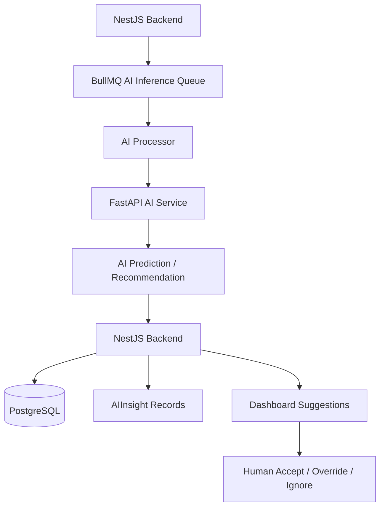
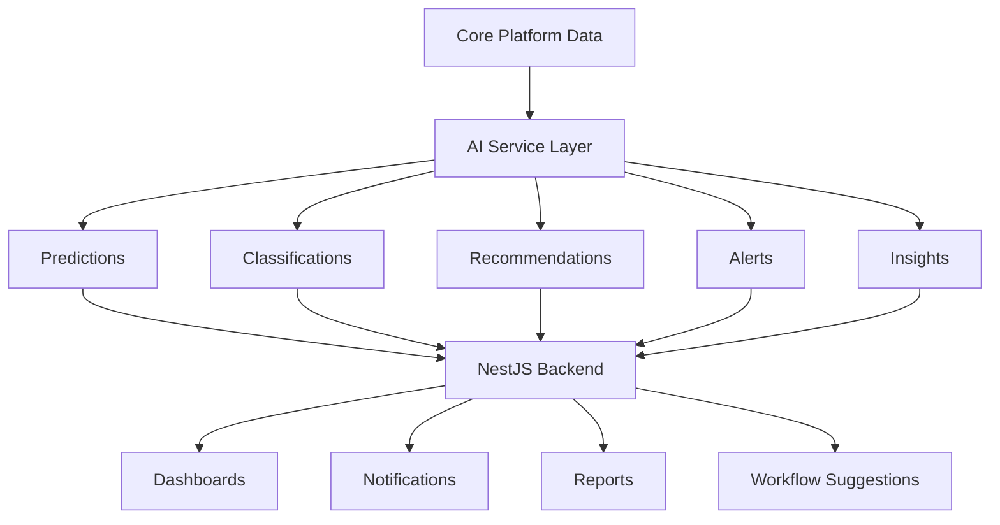
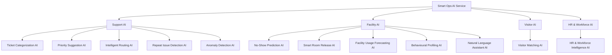
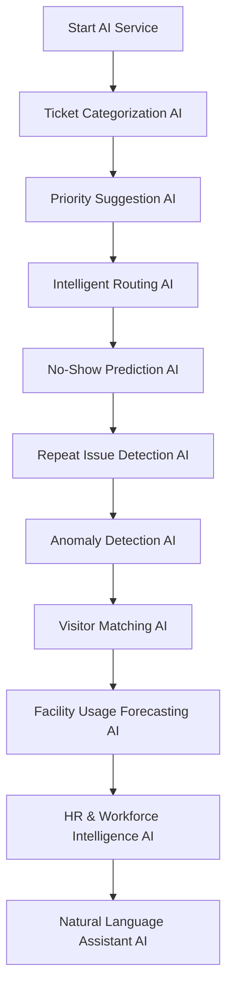
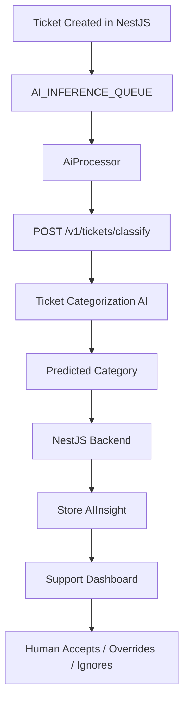
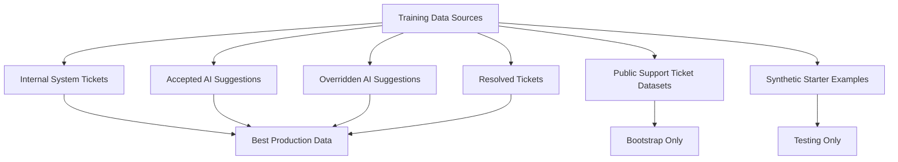
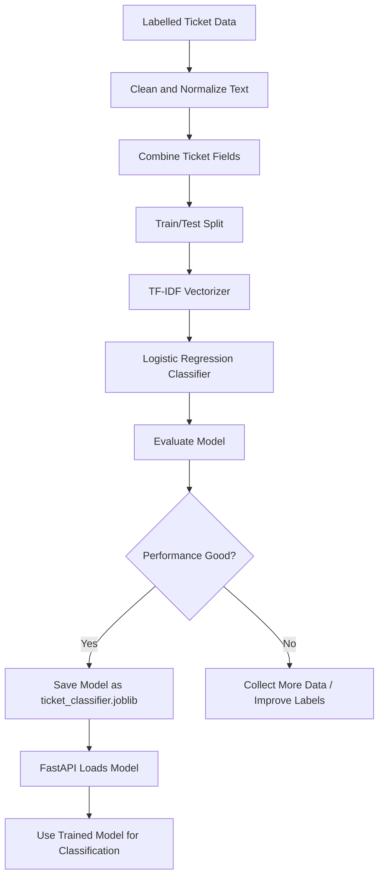
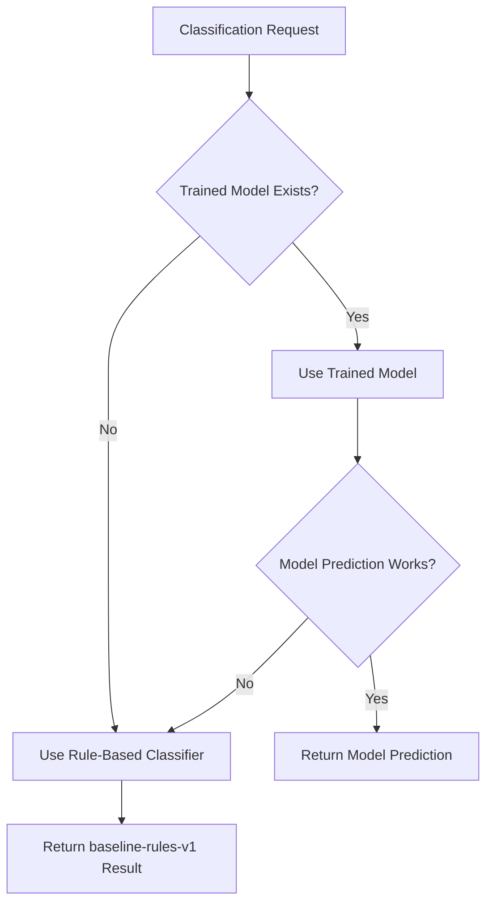
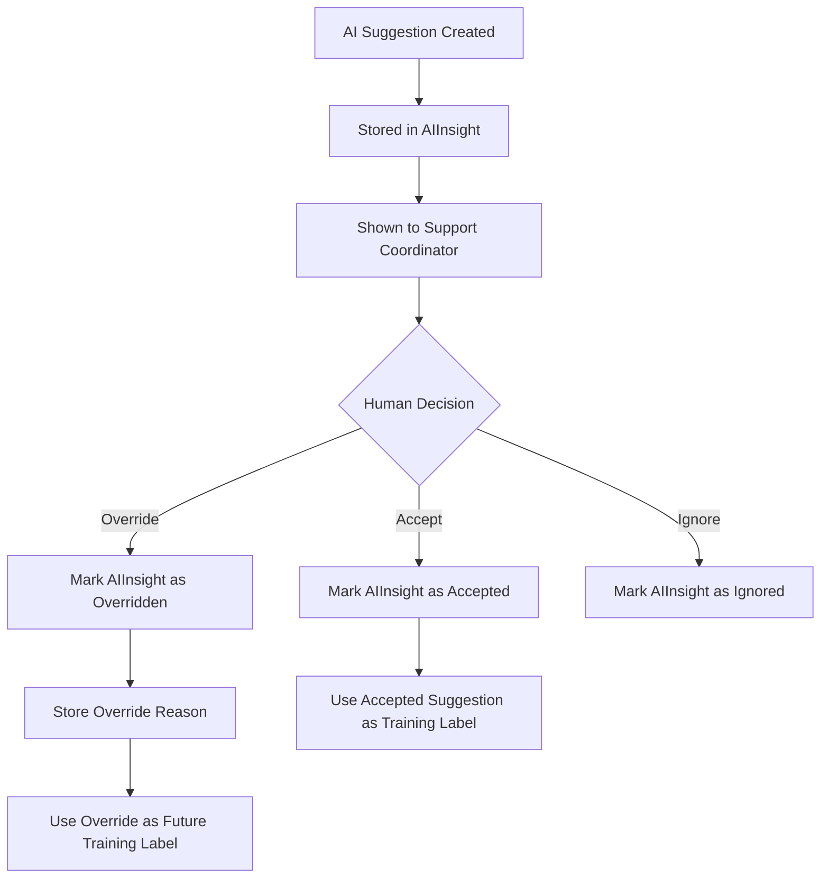
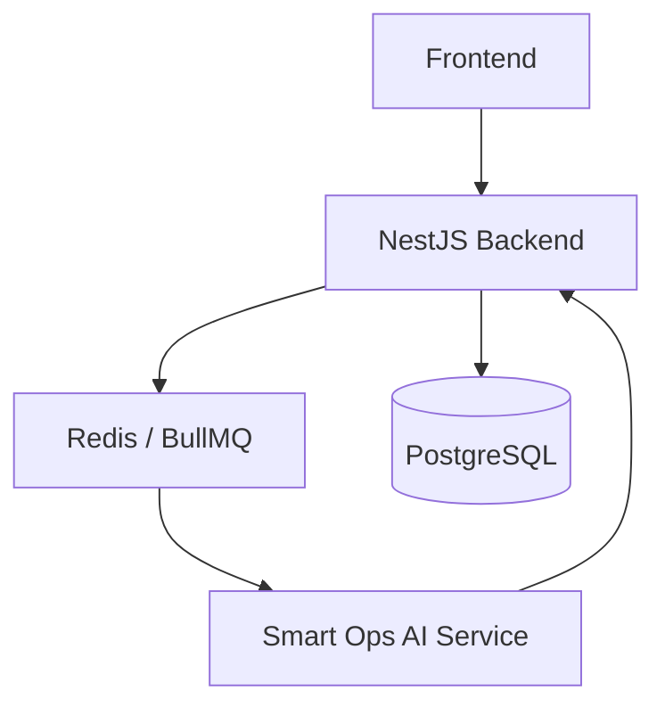

# ai-MillenOps-ai# Smart Ops AI Service


## Overview

`smart-ops-ai-service` is the independent AI microservice for the **AI-Powered Smart Facility & Support Operations System**.

The service is built with **Python**, **FastAPI**, and **scikit-learn**.

It provides AI-powered predictions, classifications, recommendations, and insights to the main NestJS backend.

The NestJS backend remains the source of truth.

This AI service does not directly modify:

- Tickets
- Bookings
- Rooms
- Visitors
- HR records
- Payroll records
- Database state

It only returns:

- Predictions
- Classifications
- Recommendations
- Confidence scores
- Explanations
- Model versions

---

## AI Architecture Summary

```txt
Main AI Service Layer: 1
AI Domains: 4
AI Capability Layers: 12
```

## AI Domains

1. Support AI
2. Facility AI
3. Visitor AI
4. HR & Workforce AI

---

## System Relationship



---

## General AI Flow



---

## Current Build Focus

We are starting with the first AI capability:

```txt
Ticket Categorization AI
```

This belongs to:

```txt
Support AI
```

First endpoint:

```txt
POST /v1/tickets/classify
```

---

## AI Capability Map



---

## Project Structure

```txt
smart-ops-ai-service/
│
├── app/
│   ├── main.py
│   │
│   ├── core/
│   │   ├── config.py
│   │   └── logging.py
│   │
│   ├── common/
│   │   ├── responses.py
│   │   ├── text_cleaning.py
│   │   └── model_loader.py
│   │
│   ├── modules/
│   │   │
│   │   ├── tickets/
│   │   │   ├── classification/
│   │   │   │   ├── router.py
│   │   │   │   ├── schemas.py
│   │   │   │   ├── rules.py
│   │   │   │   ├── model.py
│   │   │   │   ├── service.py
│   │   │   │   ├── training/
│   │   │   │   │   ├── train.py
│   │   │   │   │   └── datasets/
│   │   │   │   │       └── tickets.csv
│   │   │   │   └── models/
│   │   │   │       └── .gitkeep
│   │   │   │
│   │   │   ├── priority/
│   │   │   │   └── README.md
│   │   │   │
│   │   │   └── routing/
│   │   │       └── README.md
│   │   │
│   │   ├── bookings/
│   │   │   └── no_show/
│   │   │       └── README.md
│   │   │
│   │   ├── rooms/
│   │   │   └── repeat_issue/
│   │   │       └── README.md
│   │   │
│   │   ├── anomalies/
│   │   │   └── detection/
│   │   │       └── README.md
│   │   │
│   │   ├── visitors/
│   │   │   └── matching/
│   │   │       └── README.md
│   │   │
│   │   ├── workforce/
│   │   │   └── insight/
│   │   │       └── README.md
│   │   │
│   │   └── nlp/
│   │       └── assistant/
│   │           └── README.md
│   │
│   └── tests/
│       ├── test_health.py
│       └── test_ticket_classification.py
│
├── .env
├── .gitignore
├── requirements.txt
└── README.md
```

---

## Module Build Order



---

## Current Module: Ticket Categorization AI

### Purpose

Ticket Categorization AI reads support ticket text and predicts the correct issue category.

### Supported Categories

```txt
IT
AV / Projector
Network
Access Control
HVAC / Facility
Workspace / Meeting Room
Visitor-related
General Service
```

### Input Data

```txt
Ticket title
Ticket description
Room context
Booking context
Department
Safe metadata
```

### Output

```txt
Suggested category
Alternative categories
Confidence score
Explanation
Model version
```

---

## Ticket Categorization Flow



---

## Endpoint

```txt
POST /v1/tickets/classify
```

### Example Request

```json
{
  "ticketId": "ticket_001",
  "title": "Projector not working",
  "description": "The projector in Boardroom A is not displaying",
  "roomName": "Boardroom A",
  "bookingLinked": true,
  "department": "Operations",
  "metadata": {
    "bookingId": "booking_001",
    "roomEquipment": ["projector", "screen"],
    "activeMeeting": true
  }
}
```

### Example Response

```json
{
  "success": true,
  "capability": "TICKET_CLASSIFICATION",
  "confidence": 0.88,
  "recommendation": {
    "category": "AV / Projector",
    "alternativeCategories": [
      {
        "category": "IT",
        "confidence": 0.31
      }
    ]
  },
  "explanation": "The ticket mentions projector display failure in a meeting room.",
  "modelVersion": "baseline-rules-v1"
}
```

---

## Training Strategy

The first implementation starts with:

```txt
baseline-rules-v1
```

This is a rule-based classifier.

Later, after enough labelled ticket data exists, the service will train a scikit-learn model:

```txt
TF-IDF + Logistic Regression
```

---

## Training Data Sources



---

## Training Data Format

```csv
title,description,roomName,bookingLinked,department,finalCategory
Projector not working,Projector in Boardroom A is not displaying,Boardroom A,true,Operations,AV / Projector
Wi-Fi is down,Internet is not working in meeting room,Meeting Room 2,true,IT,Network
AC not cooling,The room is too hot,Boardroom B,false,Admin,HVAC / Facility
Door access failed,My access card cannot open the boardroom door,Boardroom A,false,Security,Access Control
Laptop cannot login,User cannot login to company laptop,,false,IT,IT
Room is dirty,Meeting room has dirty tables and chairs,Meeting Room 1,false,Admin,Workspace / Meeting Room
Visitor cannot find host,Guest arrived but host cannot be identified,Reception,false,Front Desk,Visitor-related
General assistance needed,Need help with an operational request,,false,Operations,General Service
```

---

## Model Training Flow



---

## Model Fallback Strategy



---

## Human Review Flow



---

## Setup

Create virtual environment:

```bash
python -m venv venv
```

Activate on Windows:

```bash
venv\Scripts\activate
```

Install packages:

```bash
pip install fastapi uvicorn scikit-learn pandas joblib pydantic python-dotenv numpy pytest httpx
```

Create requirements file:

```bash
pip freeze > requirements.txt
```

---

## Environment Variables

Create `.env`:

```env
APP_NAME=Smart Ops AI Service
APP_ENV=development
APP_VERSION=1.0.0
PORT=8000
DEFAULT_MODEL_VERSION=baseline-rules-v1
TICKET_CLASSIFIER_MODEL_PATH=app/modules/tickets/classification/models/ticket_classifier.joblib
```

---

## Run Service

```bash
uvicorn app.main:app --reload --port 8000
```

Health check:

```txt
http://localhost:8000/health
```

Swagger docs:

```txt
http://localhost:8000/docs
```

---

## Test Manually

Use Swagger or curl.

### Projector Test

```json
{
  "ticketId": "ticket_001",
  "title": "Projector not working",
  "description": "The projector in Boardroom A is not displaying",
  "roomName": "Boardroom A",
  "bookingLinked": true,
  "department": "Operations"
}
```

Expected category:

```txt
AV / Projector
```

### Network Test

```json
{
  "ticketId": "ticket_002",
  "title": "Wi-Fi is down",
  "description": "Internet is not working in the meeting room",
  "roomName": "Meeting Room 2",
  "bookingLinked": true,
  "department": "IT"
}
```

Expected category:

```txt
Network
```

### HVAC Test

```json
{
  "ticketId": "ticket_003",
  "title": "AC not cooling",
  "description": "The room is too hot and the air conditioner is not working",
  "roomName": "Boardroom B",
  "bookingLinked": false,
  "department": "Admin"
}
```

Expected category:

```txt
HVAC / Facility
```

---

## Run Tests

```bash
pytest
```

---

## Train Model

Run:

```bash
python app/modules/tickets/classification/training/train.py
```

If there is not enough real data, the service should continue using:

```txt
baseline-rules-v1
```

---

## Deployment Concept

The AI service is deployed separately from the NestJS backend.



In local development:

```txt
Frontend: http://localhost:5173
NestJS Backend: http://localhost:5000
AI Service: http://localhost:8000
PostgreSQL: localhost:5432
Redis: localhost:6379
```

Backend `.env`:

```env
AI_SERVICE_URL=http://localhost:8000
AI_QUEUE_ENABLED=true
AI_CONFIDENCE_THRESHOLD=0.70
```

In Docker deployment:

```env
AI_SERVICE_URL=http://smart-ops-ai-service:8000
```

---

## AI Safety Rules

```txt
1. AI only recommends.
2. NestJS remains the source of truth.
3. AI does not directly modify database records.
4. AI results must be stored in AIInsight.
5. Every AI response must include confidence.
6. Every AI response must include explanation.
7. Every AI response must include modelVersion.
8. Low-confidence results require manual review.
9. Human override must always be available.
10. Failed AI calls must not break core workflows.
```

---

## Future Modules

The following modules will be added later inside the same AI service.

### Priority Suggestion AI

```txt
POST /v1/tickets/priority
```

Suggests:

```txt
Low
Medium
High
Critical
```

### Intelligent Routing AI

```txt
POST /v1/tickets/routing
```

Recommends best technician, developer, or team.

### No-Show Prediction AI

```txt
POST /v1/bookings/no-show
```

Predicts booking no-show risk.

### Repeat Issue Detection AI

```txt
POST /v1/rooms/repeat-issue
```

Detects recurring room or asset problems.

### Anomaly Detection AI

```txt
POST /v1/anomalies/detect
```

Detects unusual operational patterns.

### Visitor Matching AI

```txt
POST /v1/visitors/match
```

Matches visitors to hosts, bookings, or meetings.

### Workforce Insight AI

```txt
POST /v1/workforce/insight
```

Detects workforce availability and shift pressure risks.

### Natural Language Assistant AI

```txt
POST /v1/nlp/parse-command
```

Parses natural language commands for bookings and tickets.

---

## Final Goal

The goal of this service is to provide a safe AI layer for the main platform.

The first completed capability is:

```txt
Ticket Categorization AI
```

The service will grow module by module while keeping one FastAPI server and one integration point with the NestJS backend.
